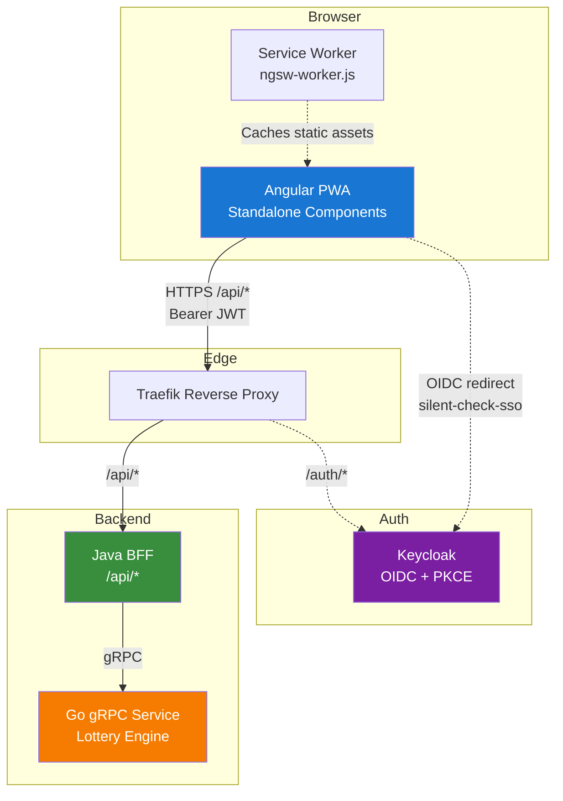

# Statistiloto UI

Angular 20 PWA frontend for Statistiloto — Israeli lottery analysis and number generation based on historical patterns.

## Tech Stack

| Layer | Technology |
|-------|-----------|
| Framework | Angular 20 (standalone components, signals, zoneless-ready) |
| Change Detection | `OnPush` (enforced via `angular.json` schematics defaults) |
| UI Components | PrimeNG 20 + PrimeIcons + @primeuix/themes (Aura preset) |
| Styling | SCSS, CSS custom properties, dark mode via `.app-dark` class |
| Auth | keycloak-js 25 (OIDC authorization-code + PKCE S256) |
| PWA | @angular/service-worker (ngsw-worker.js) |
| i18n | Custom signal-based service (Hebrew default, RTL/LTR switching) |
| HTTP | Angular `HttpClient` with functional interceptors (auth + error) |
| Testing | Karma/Jasmine (unit), Playwright (E2E) |
| Build | Angular CLI application builder → static files served by Nginx |
| Runtime | Node 22 (build), Nginx 1.27 Alpine (serve) |

## Features

| Route | Component | Description |
|-------|-----------|-------------|
| `/` | `HomeComponent` | Landing page with quick-action links to all features |
| `/generate` | `GenerateComponent` | Generate systematic lottery forms that have never won, optionally including lucky numbers |
| `/lucky` | `LuckyComponent` | Pick and save up to 8 personal lucky numbers |
| `/statistics` | `StatisticsComponent` | Discover the most frequently appearing number groups |
| `/analyze` | `AnalyzeComponent` | Analyze custom number sets against historical draws |
| `/saved` | `SavedNumbersComponent` | View, analyze, and delete saved numbers and generated forms |
| `/assistant` | `AssistantComponent` | Full-page AI assistant chat with human-in-the-loop approval |
| `/admin` | `AdminComponent` | Admin dashboard (redirects to `/admin/llm-config`) |
| `/admin/llm-config` | `LlmConfigComponent` | Manage LLM configurations: edit the active config (provider/model/API key/timeout), list/create/activate/delete/test stored configs, and fetch available models per provider |
| `/admin/token-usage` | `TokenUsageComponent` | View per-user token consumption and cost |
| `/admin/audit-log` | `AuditLogComponent` | Searchable audit log of user actions |
| `/admin/scraper` | `ScraperComponent` | Trigger the lottery data scraper (with HITL approval) |

## Architecture Overview



**Key principle:** The UI talks **only** to the Java BFF at `/api/*` through Traefik. It never calls the Go gRPC service directly. The BFF proxies lottery computation requests to Go and owns user-specific data (saved numbers, profiles).

## Project Structure

```
ui/
├── src/
│   ├── app/
│   │   ├── app.component.ts          # Root shell (side menu, agent widget, toast)
│   │   ├── app.config.ts             # Providers: router, HTTP interceptors, PrimeNG, SW, auth init
│   │   ├── app.routes.ts             # Lazy-loaded standalone routes with authGuard
│   │   ├── core/
│   │   │   ├── api/
│   │   │   │   ├── api.service.ts           # BFF REST calls (generate, statistics, analyze, saved numbers)
│   │   │   │   ├── agent.service.ts         # Agent chat/approve, LLM config (active + stored CRUD/test/activate), llm-models, token usage, audit log, scraper, sessions CRUD, reindex
│   │   │   │   └── agent-context.service.ts # Signal bridge for contextual AI triggers
│   │   │   ├── auth/
│   │   │   │   ├── auth-config.ts           # KeycloakConfig injection token
│   │   │   │   ├── auth.service.ts          # keycloak-js wrapper (signals: isAuthenticated, username, isAdmin)
│   │   │   │   └── auth.guard.ts            # CanActivateFn — redirects to login if unauthenticated
│   │   │   ├── i18n/
│   │   │   │   └── language.service.ts      # Signal-based i18n (he/en), RTL/LTR, flat dictionary
│   │   │   ├── interceptors/
│   │   │   │   ├── auth.interceptor.ts      # Adds Bearer JWT, refreshes token with 30s skew
│   │   │   │   └── error.interceptor.ts     # Logs 401/429, re-throws errors
│   │   │   ├── theme/
│   │   │   │   └── theme.service.ts         # Dark/light toggle, localStorage persistence
│   │   │   └── sw-register.ts              # Service worker registration provider
│   │   ├── features/
│   │   │   ├── home/                        # Landing page
│   │   │   ├── generate/                    # Form generation
│   │   │   ├── lucky/                       # Lucky numbers picker
│   │   │   ├── statistics/                  # Frequency statistics
│   │   │   ├── analyze/                     # Number analysis
│   │   │   ├── saved-numbers/               # Saved numbers management
│   │   │   ├── assistant/                   # Full-page AI assistant
│   │   │   └── admin/                       # Admin dashboard
│   │   │       ├── audit-log/
│   │   │       ├── llm-config/
│   │   │       ├── scraper/
│   │   │       └── token-usage/
│   │   └── shared/
│   │       ├── components/
│   │       │   ├── agent-chat/              # Reusable chat UI with HITL approval cards
│   │       │   ├── agent-widget/            # Floating AI widget (bottom-right)
│   │       │   ├── analyze-modal/           # Modal showing frequency analysis
│   │       │   ├── archive-window/          # Date range picker for archive queries
│   │       │   ├── lottery-ball/            # Single numbered ball
│   │       │   ├── number-set/              # A set of balls (with optional strong number)
│   │       │   ├── number-set-list/         # List of number sets with save/analyze/delete actions
│   │       │   ├── side-menu/               # Navigation drawer
│   │       │   └── toast/                   # Toast notifications + loading overlay
│   │       ├── models/
│   │       │   └── lottery.models.ts        # Shared TypeScript interfaces
│   │       ├── pipes/
│   │       │   └── translate.pipe.ts        # `| translate` pipe backed by LanguageService
│   │       ├── services/
│   │       │   └── archive-window.service.ts # Shared archive date-range signal
│   │       └── utils/
│   │           └── arrays-filter.ts         # Array utility functions
│   ├── environments/
│   │   ├── environment.ts                   # Dev config (apiBaseUrl, keycloak)
│   │   └── environment.prod.ts              # Prod config
│   ├── index.html
│   ├── main.ts                              # bootstrapApplication
│   ├── manifest.webmanifest                 # PWA manifest
│   ├── silent-check-sso.html                # Hidden iframe for Keycloak silent SSO check
│   └── styles.scss                          # Global styles, CSS variables
├── e2e/                                     # Playwright E2E tests
│   ├── full-flow.spec.ts
│   ├── admin-agent.spec.ts
│   └── test-env.ts
├── Dockerfile                               # Multi-stage: node:22 build → nginx:1.27 serve
├── nginx.conf                               # SPA fallback, security headers, gzip, caching
├── angular.json
├── playwright.config.ts
├── karma.conf.js
└── package.json
```

## Quick Start

### Prerequisites

- Node.js 22+
- npm
- A running Statistiloto backend stack (Traefik, Java BFF, Go service, Keycloak) accessible at `http://localhost`

### Install & Run

```bash
# Install dependencies
npm install --legacy-peer-deps

# Start dev server (http://localhost:4200)
npm start

# Build for production
npm run build

# Watch mode (development configuration)
npm run watch
```

### Environment Configuration

The app reads configuration from `src/environments/environment.ts` (dev) and `environment.prod.ts` (prod, swapped via `fileReplacements` in `angular.json`):

```typescript
export const environment = {
  production: false,
  apiBaseUrl: '/api',          // All API calls go to /api/* (proxied by Traefik to BFF)
  keycloak: {
    url: 'http://localhost/auth',  // Dev: absolute URL; Prod: '/auth' (same origin via Traefik)
    realm: 'statistiloto',
    clientId: 'statistiloto-ui',
  },
};
```

| Variable | Dev | Prod | Notes |
|----------|-----|------|-------|
| `apiBaseUrl` | `/api` | `/api` | Relative path; Traefik routes to Java BFF |
| `keycloak.url` | `http://localhost/auth` | `/auth` | Keycloak base URL |
| `keycloak.realm` | `statistiloto` | `statistiloto` | Keycloak realm |
| `keycloak.clientId` | `statistiloto-ui` | `statistiloto-ui` | OIDC client ID |

The `AUTH_CONFIG` injection token (`src/app/core/auth/auth-config.ts`) provides the Keycloak config to `AuthService` at runtime.

## Docker

The Dockerfile uses a multi-stage build:

```dockerfile
# Stage 1: Build
FROM node:22-alpine AS builder
# ... npm install, ng build --configuration production

# Stage 2: Serve
FROM nginx:1.27-alpine
# ... copies dist to nginx html, uses custom nginx.conf
```

### Build the image

```bash
# From the repository root (Dockerfile expects ui/ subdirectory context)
docker build -t statistiloto-ui .

# Or via docker compose (recommended — starts the full stack)
docker compose up --build
```

### Nginx configuration (`nginx.conf`)

- **SPA fallback:** `try_files $uri $uri/ /index.html` — all routes served by `index.html`
- **Service worker:** `ngsw-worker.js` served with `no-cache` header
- **Static assets:** CSS/JS/images/fonts cached for 1 year (`immutable`)
- **Security headers:** `X-Frame-Options: SAMEORIGIN`, `X-Content-Type-Options: nosniff`, `Referrer-Policy: strict-origin-when-cross-origin`
- **Gzip:** Enabled for CSS, JS, JSON, SVG

## Testing

### Unit Tests (Karma + Jasmine)

```bash
npm test
```

Runs via `@angular-devkit/build-angular:karma` with Chrome. Spec files are co-located with their source (e.g., `agent.service.spec.ts`). Coverage is configured via `karma.conf.js`.

### E2E Tests (Playwright)

```bash
# Ensure the full stack is running (docker compose up)
npx playwright test

# Run with visible browser
PW_HEADLESS=false npx playwright test

# Run a specific test file
npx playwright test e2e/full-flow.spec.ts
```

**Configuration** (`playwright.config.ts`):
- Base URL: `http://localhost` (Traefik edge proxy)
- Browser: Chromium (headless by default)
- Timeout: 120s per test, 30s for assertions
- Reuses an existing server (does not start one itself)

**Test environment** (`.env.example` → copy to `.env`):
- `PLAYWRIGHT_BASE_URL` — target URL
- `TEST_USER_EMAIL` / `TEST_USER_PASSWORD` — test user credentials
- `TEST_REGISTER_USER_*` — registration test user
- `KEYCLOAK_ADMIN_*` — admin credentials for test user auto-creation
- `TEST_AUTO_CREATE_USER` — auto-create test user before running

**Test files:**
- `e2e/full-flow.spec.ts` — end-to-end user journey (login, generate, save, analyze)
- `e2e/admin-agent.spec.ts` — admin pages and AI agent flows

## Documentation Links

- [Requirements](docs/REQUIREMENTS.md) — Functional and non-functional requirements derived from the codebase
- [Flows](docs/FLOWS.md) — Mermaid sequence/flow diagrams for authentication, navigation, generation, agent chat, and admin operations
