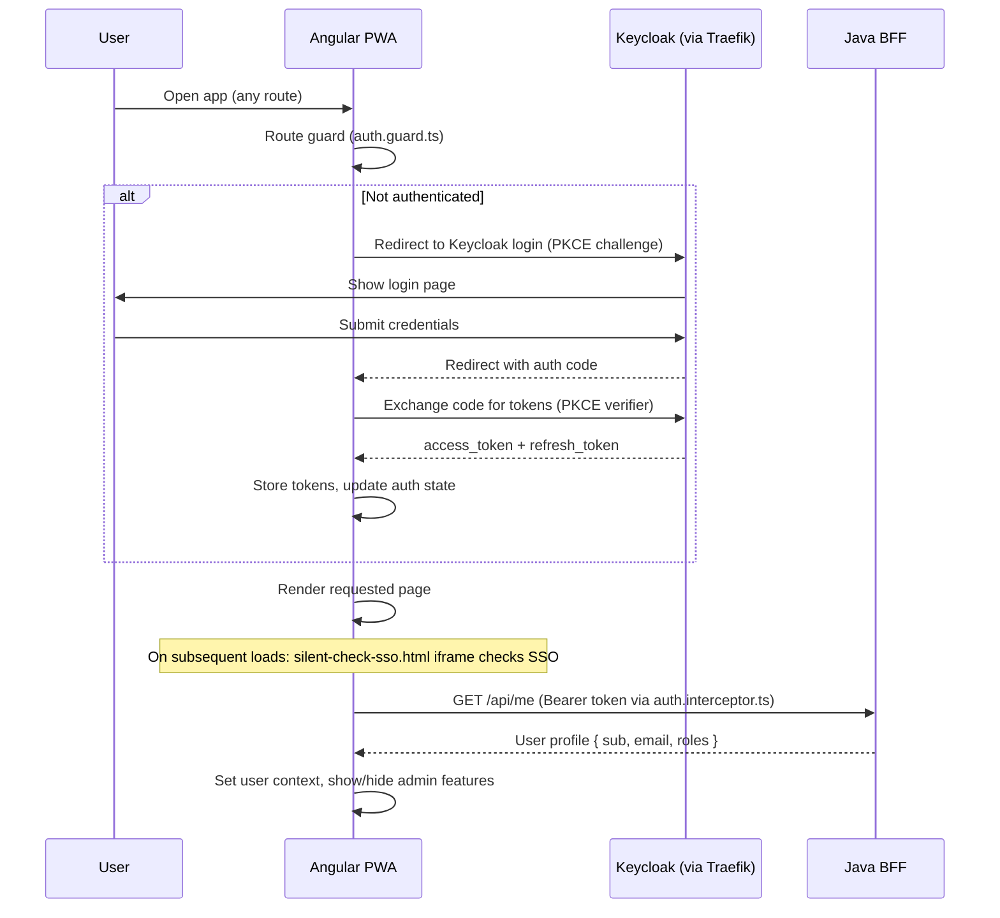
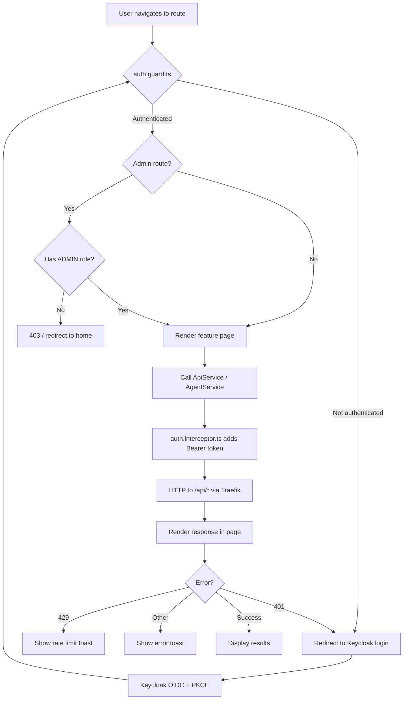
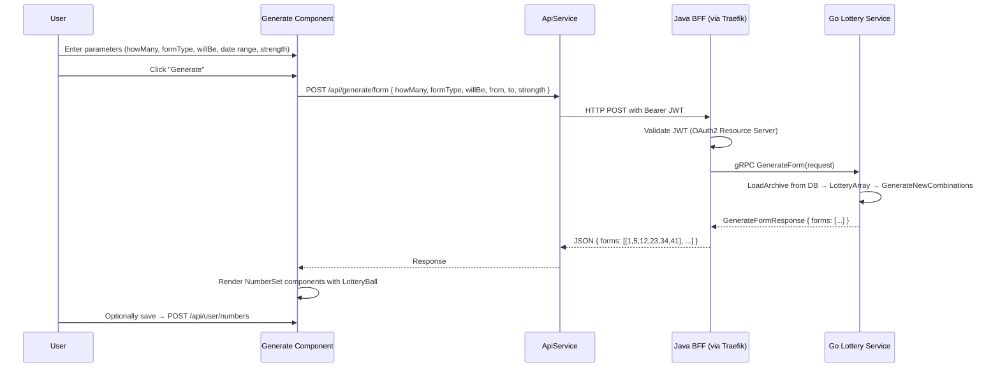
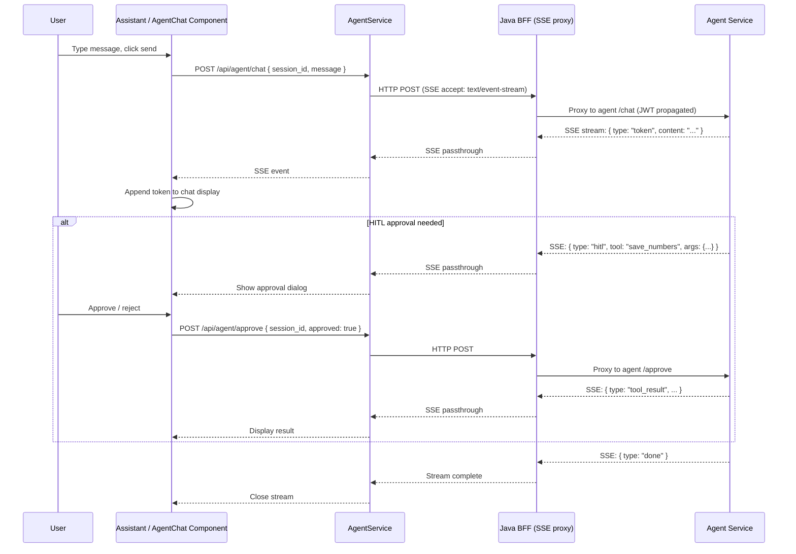
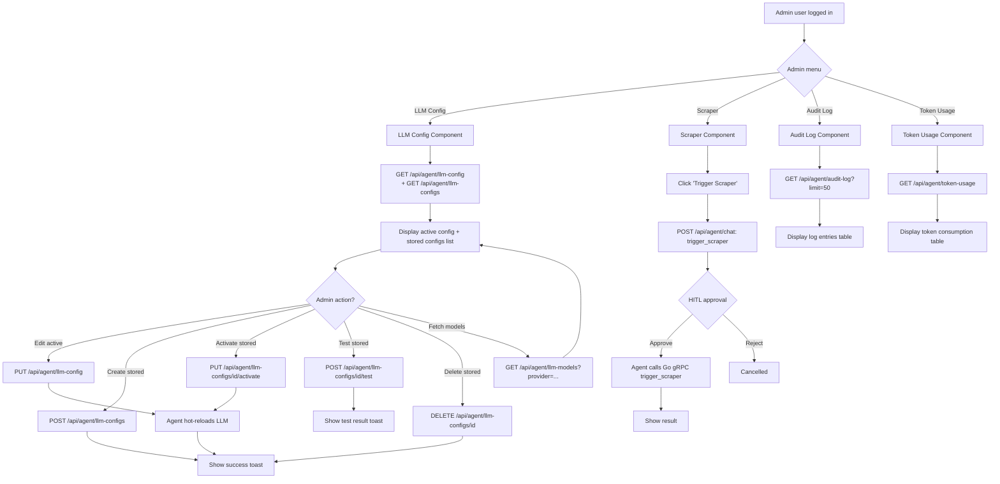
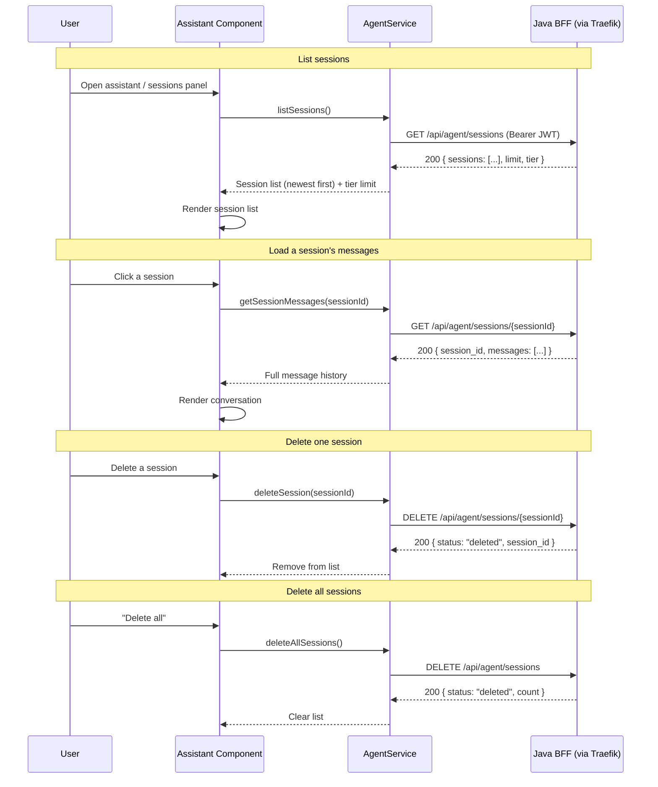

# Statistiloto UI — Flow Documentation

Mermaid diagrams for the main user flows from the UI perspective.

---

## 1. User Authentication Flow

---

## 2. Page Navigation Flow

---

## 3. Generate Form Flow

---

## 4. Agent Chat Flow

---

## 5. Admin Operations Flow

---

## 6. Agent Session Management Flow

